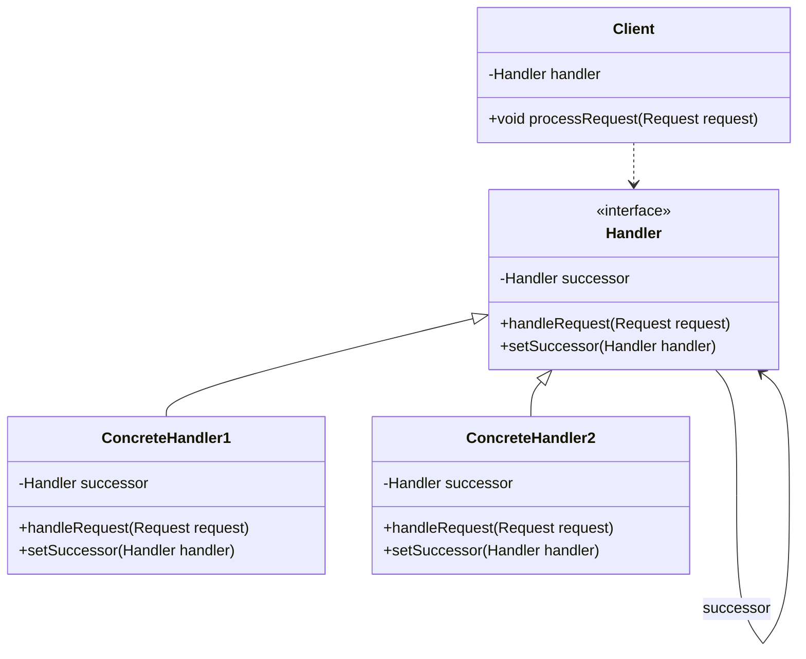

# Chain of Responsibility

Chain of responsibility decouples objects from the code that calls them.

## How it works

Client knows about the first object in the chain and uses that object to send a request to.

That object will either handle the request or pass the request on to the successor in the chain if it exists.

Handling is not guaranteed; maybe no object in the chain can handle the request of them client.

# UML

