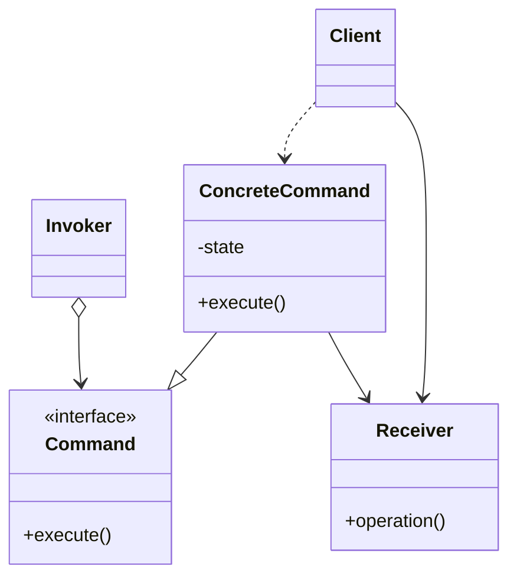

# Command

Used to represent a request or method call as an object, this design pattern is structurally easy to implement  
but very powerful. This allows the command to be passed around and executed at a later time. 

These are just a few of the ways this can be used
* in another part of the code  
* on a remote server  
* we can queue the commands and execute them from a thread

## UML
* Command interface: ensures any implementations will have an execute command
* Concrete command: implementation of the command interface; contains the state property and execute command
  * has the object on which the method is called and the arguments passed to that method
  * has information about what the command should do
  * knows which method to call on the object 
  * knows the arguments passed to the command
* Receiver - has a method invoked by the command
* Invoker - calls the command's execute method
* Client - creates the concrete command and sets its receiver

