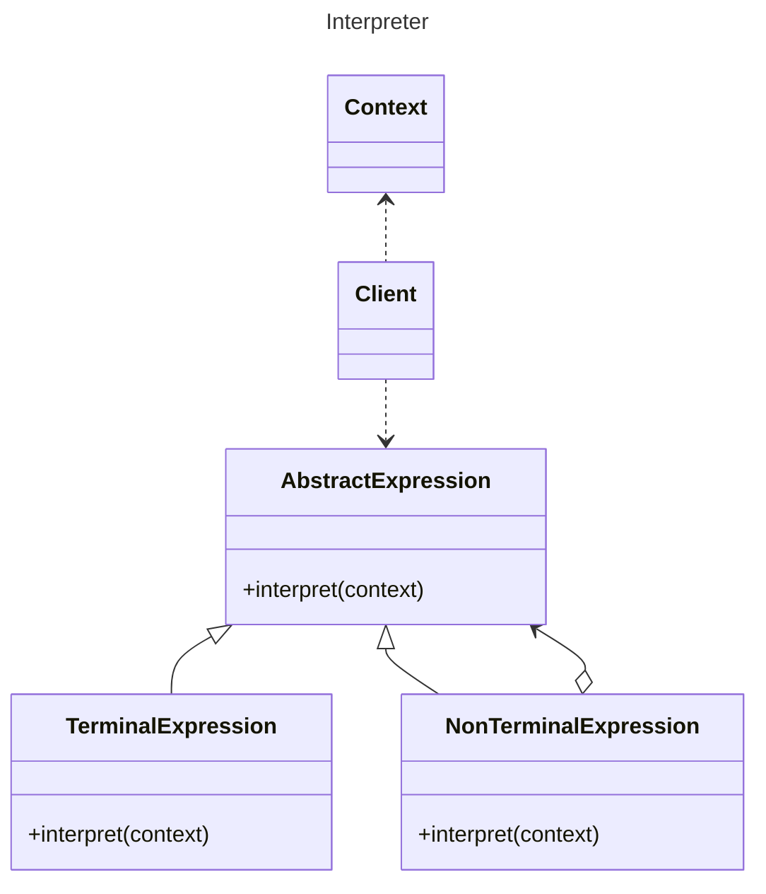

# Interpreter

## About 
* Use when needing to interpret rules of a language  
* This pattern isn't used for things like natural language processing  
* Each class represents a rule and provides a method to interpret the rule  


## Components 
### `AbstractExpression`  
interface/base class for all expressions  
- defines the interpret method  
- interpret method takes a context as a parameter  

### `TerminalExpression`  
class that represents a terminal expression  
- leaf node in the expression tree  
- doesn't have any child expressions  
- implements the interpret method  

### `NonTerminalExpression`  
class that represents a non-terminal expression  
- has child expressions  
- implements interpret method  
- when the interpret method is called, it calls the interpret method on each child expression    
- the result of the interpret method on each child expression is combined to form the result of the interpret method on the non-terminal expression  

### `Context`  
holds the information needed by the interpreter  
- holds the statement to be interpreted  
- can hold the resultset of the statement  
- use as we choose  

### `Client`  
calls the interpret method on the expression and uses the result  
- optionally builds the syntax tree based on the language rules  
- calls the interpret method on the expression to evaluate the expression  

## UML Diagram



## Example

This module uses the Interpreter pattern to check if a User can access a Report based on a small rule string (e.g., "NOT ADMIN", "FINANCE_USER AND ADMIN").

Key pieces
- PermissionExpression: Interface for all expressions (interpret(User) -> boolean).
- Permission: Terminal check for a single permission token.
- AndExpression / OrExpression / NotExpression: Combine or negate sub-expressions.
- Report: Holds a report name and its permission rule string.
- User: Holds username and a case-insensitive list of permissions.
- ExpressionBuilder: Parses the rule string and builds the expression tree.
- Client: Small demo that parses a rule and evaluates it for a user.

Client demo
```java
package main.com.watkins.behavioral.interpreter;

public class Client {

    public static void main(String[] args) {
        Report report1 = new Report("Cashflow report", "NOT ADMIN");
        ExpressionBuilder builder = new ExpressionBuilder();

        PermissionExpression exp = builder.build(report1);
        System.out.println(exp); // prints:  NOT admin

        User user1 = new User("Dave", "USER");

        System.out.println("User access report: " + exp.interpret(user1)); // true
    }
}
```

Notes
- Tokens are whitespace-separated; no parentheses or operator precedence.
- Matching is case-insensitive for both permissions and operators.