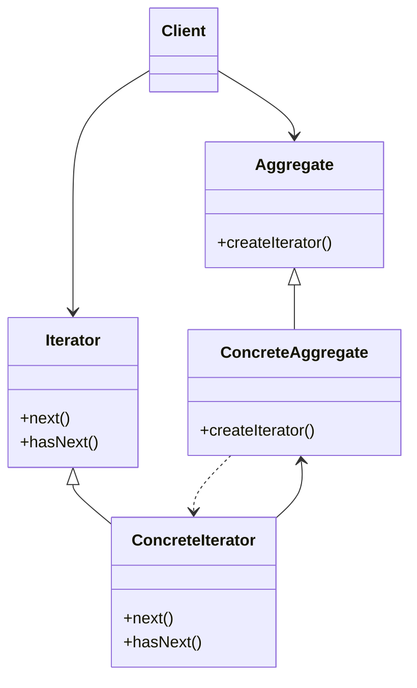

# Iterator

## About

Used to iterate over a collection. Allows access to a collection of elements without exposing its underlying representation.  

Iterators  
* are used to traverse collections  
* hide the details of how the collection is stored  
* are stateful; meaning they remember its position within in the collection  
* are sensitive to changes to the collection  
* assume the underlying collection won't change during iteration  
* become invalid after the collection changes  

## Use case

To iterate over a collection.

## Components

Iterator
* defines an interface for accessing the elements of a collection object sequentially without exposing its underlying representation  

ConcreteIterator  
* contains logic to iterate over the collection  
* implements the iterator interface  
* has state remembering position in the collection  
* knows where to find the collection of elements  

Aggregate
* defines an interface to create iterator and access/manipulate objects in a collection  

ConcreteAggregate
* implements method to return an iterator

## UML Diagram

