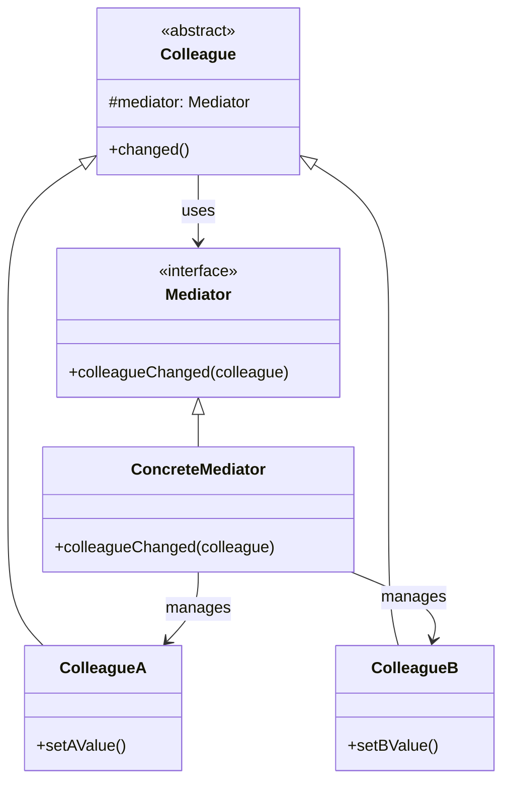

# Mediator

## About

The Mediator pattern defines an object that encapsulates how a set of objects interact, promoting loose coupling by 
preventing objects from referring to each other explicitly. Said another way, A central coordinator that manages 
communication between objects so they don't need to know about each other directly.

## Use case
  * to manage multiple objects
  * to decouple the objects from each other

## Components

* Mediator
  * acts as a central hub
  * coordinates communication between objects
* Colleague
  * objects that interact with the mediator

## UML Diagram

