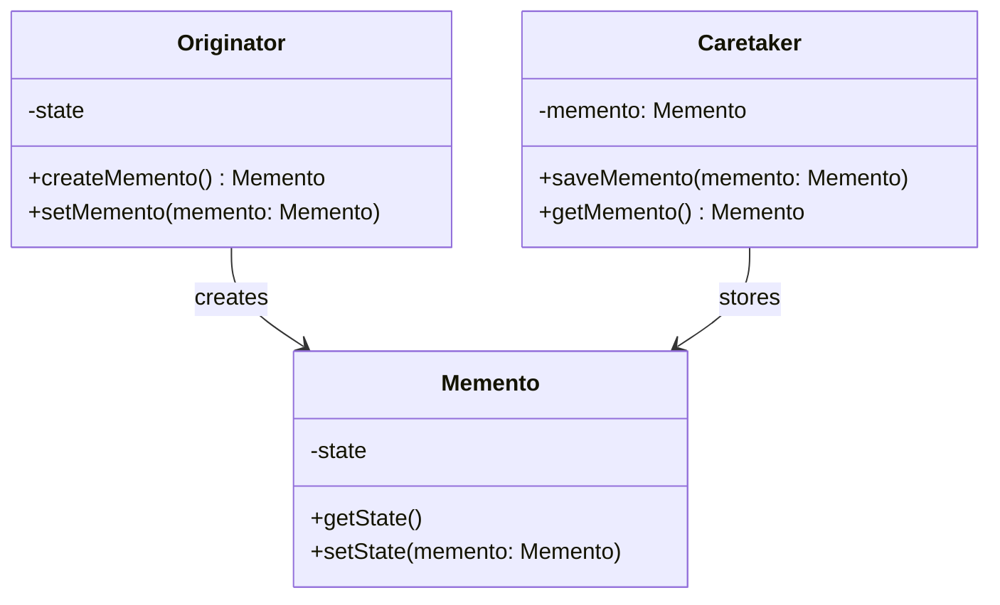

# Memento

## About

Solves a very specific problem. when we want to store an objects state and want no one to read the state. Used when we 
want to store all values of state. save it in order to perform ops in the future. It is a snapshot of an object's 
state. The only object that can access the state is the object that it is created from.

## Use case

Used in undo functionality. An example of this is word processor applications.

## Components

* memento – a snapshot of the originator's state
* originator – creates the memento 
* caretaker – stores the memento

## UML Diagram

