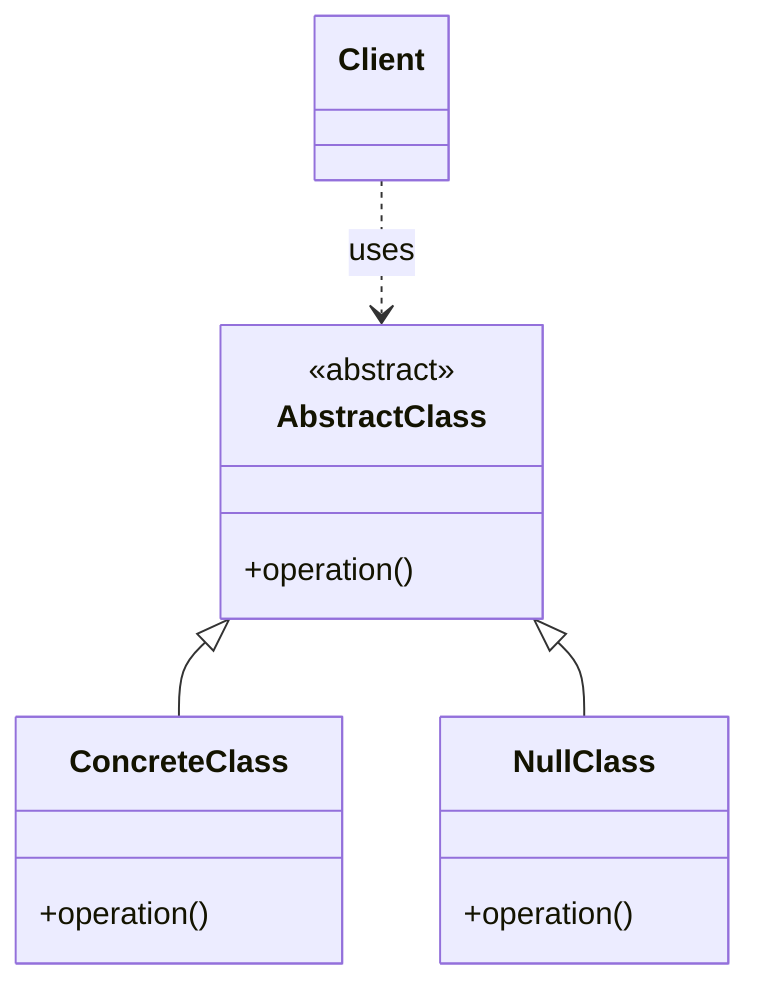

# Null Object

## About

Presents an alternate representation to indicate the absence of an object.

Instead of returning `null` and forcing every caller to check for it, return an object that implements the same
interface but provides harmless default behavior. This keeps client code simple and moves the "do nothing" behavior
into one well-known class.

## Use case

Use when a client expects an object but the real object may be missing or unavailable.

Common examples:
- A guest user when no user is logged in
- A logger that discards messages when logging is disabled
- A customer record that represents an unknown customer
- A command or handler that performs no action

## Components

- AbstractObject - interface or abstract class used by both the real object and the null object
- RealObject - normal implementation with actual behavior
- NullObject - implementation with neutral or default behavior
- Client - works with the abstract type and does not need repeated null checks

## UML Diagram



## Example

Without this pattern, client code often looks like this:

```java
Customer customer = repository.findCustomer(id);

if (customer != null) {
    customer.sendPromotion();
}
```

With Null Object, the repository can return an `UnknownCustomer` instead of `null`:

```java
Customer customer = repository.findCustomer(id);
customer.sendPromotion();
```

The `UnknownCustomer` implements the same `Customer` interface, but `sendPromotion()` does nothing or provides a safe
default response.

## Notes

- Use this pattern when "missing object" is a valid, expected case.
- Do not use it to hide errors that should fail loudly.
- Make the null object's behavior predictable and side-effect free.
