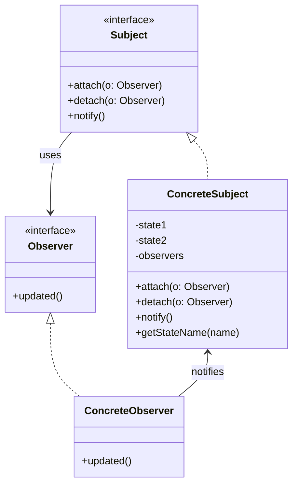

# Observer

Notify multiple objects that our state has changed.  
One object has a state and notifies others on state change.   
The objects that get notified are called observers. 
This pattern is also referred to as publish-subscribe. (pub-sub)

## About

A single object publishes when its state changes. Multiple observers will subscribe to the state change.
One-to-many relationship between objects.
Without tight coupling using interfaces.
Observers don't get details about what property has changed, jsut that asomething has changed.  
The obersers will then ask what property changed.  

## Use case

multiple objects need to be notified when a state changes without having to know the details of what changed.

## Components

observers – notifying multiple objects of a change.  
observable – the object that is being observed.

## UML Diagram

