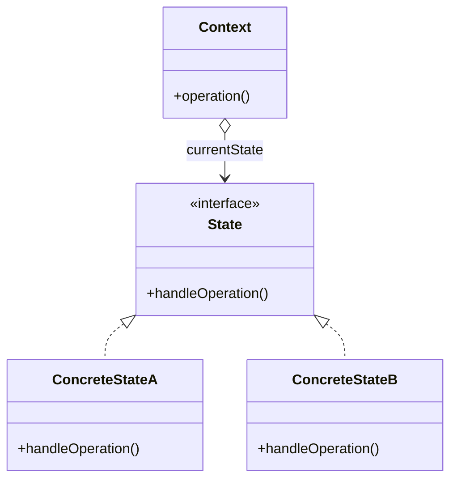

# State

Allows objects to behave differently based on its current internal state

## About

State-specific behaviors in separate classes
state transitions are triggered by the states themselves
new states can be added without modifying the original class
state can be changed at any time

## Use case

When an object’s behavior changes based on its current state, and you want to avoid giant if or switch statements

## Components

The components of a state pattern are:
- Context
- State
- ConcreteState

## UML Diagram

