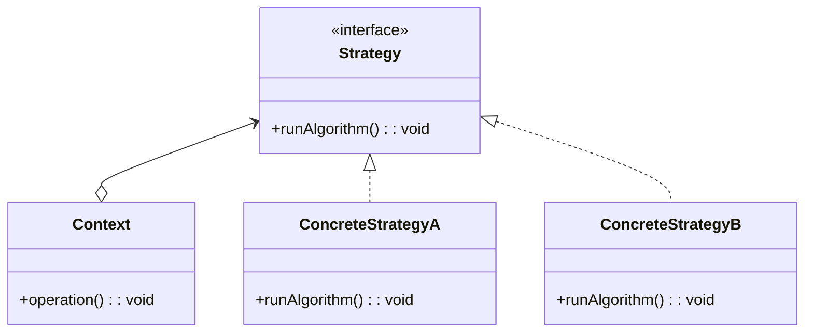

# Strategy

Encapsulates an algorithm in a class

## About

Helpful if there are many variations of an algorithm

## Use case

If you see a lot of conditions to switch between different algorithms, then you can use strategy
to encapsulate the algorithm. Use child classes to implement the various algorithms.

## Components

* Strategy
* Context
* ConcreteStrategyA
* ConcreteStrategyB

## UML Diagram

