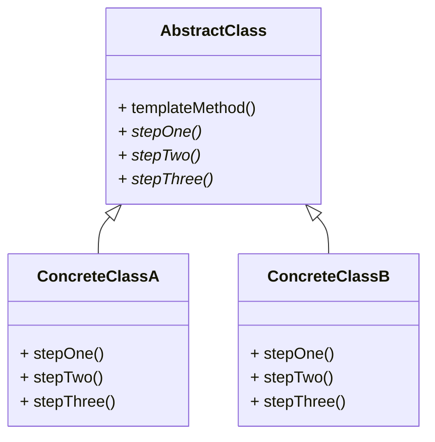

# Template Method

Defines an algorithm in a method as a series of steps.  
Each step in the algorithm is a method call.  
Each method is an abstract method in the same class.  
Subclasses will extend from the base class and provide the implementation.  

## About

Helpful when you have an algorithm with a fixed structure but steps that vary by implementation. 
The abstract class owns the algorithm skeleton; subclasses fill in the details without changing the overall flow. 

## Use case

If you see duplicated code across subclasses that follows the same sequence of steps but differs in the details 
of each step, use Template Method to hoist the shared sequence into a base class and let subclasses override 
only the parts that differ.

## Components

* AbstractClass — defines `templateMethod()` and declares abstract steps
* ConcreteClassA — implements the abstract steps one way
* ConcreteClassB — implements the abstract steps another way; may also override optional hook methods

## UML Diagram

