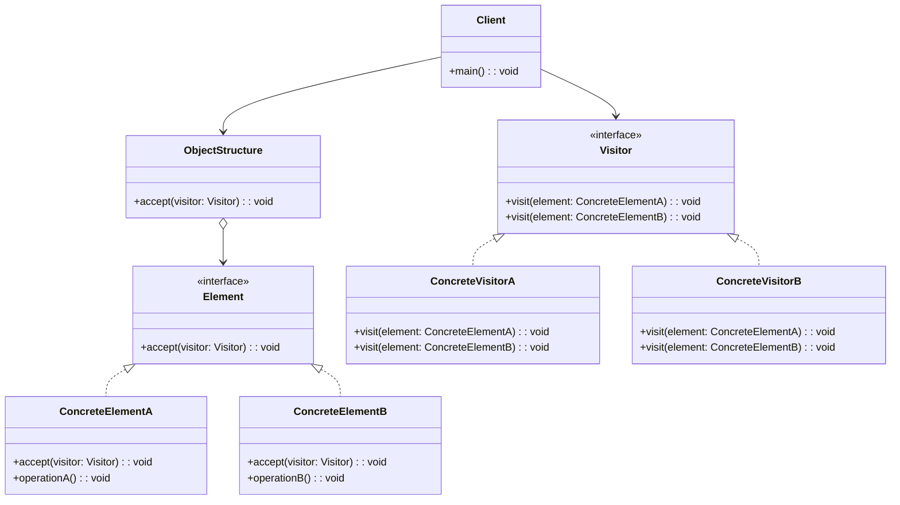

# Visitor

## About

Allows us to perform new operations on an object without changing the class
Visits all the nodes of a structure and performs an operation on them by passing itself as an object
each time we need a new operation we create a new visitor

## Use case

Use Visitor when you have a stable set of object types, but you need to add new operations often.
Instead of changing each element class every time a new operation is needed, create a new visitor
that implements the operation for each concrete element.

This is useful for object structures like trees, reports, documents, or workflows where different
operations need to run across many element types.

## Components

* Client
* ObjectStructure
* Element
* ConcreteElementA
* ConcreteElementB
* Visitor
* ConcreteVisitorA
* ConcreteVisitorB

## UML Diagram

