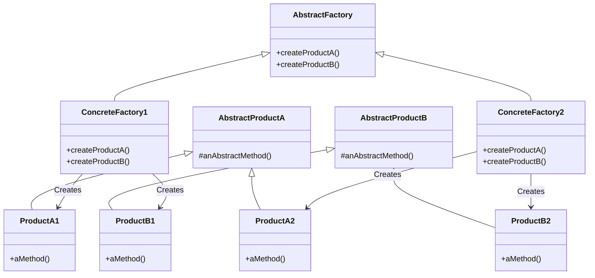

# Abstract Factory

You can think of the abstract factory as an object with multiple factory methods

## UML Diagram

**In the diagram:**
- **AbstractFactory** is an abstract class that declares the factories for creating AbstractProductA and 
AbstractProductB
- **ConcreteFactory and ConcreteFactory2** are concrete classes that implement AbstractFactory
- **ConcreteFactory1** creates ProductA1 and ProductB1
- **ConcreteFactory2** creates ProductA2 and ProductB2
- **AbstractProductA and AbstractProductB** are abstract classes that define products to be created
- **ProductA1, ProductA2, ProductB1, ProductB2** are concrete classes that implement AbstractProductA and 
AbstractProductB, respectively.

## Implementation Steps

- study the product sets
- create abstract factory - is an abstract class or interface
- abstract factory defines abstract methods for creating products
- provide concrete implementation of factory for each set of products
- makes use of factory method pattern

## Implementation Considerations

- factories can be implemented as singletons since we usually only need one class
- when adding a new product type, it requires changes to the abstract factory and implementations of factories
- give the client the concrete factory so it can create the objects

## When to use Abstract Factory Pattern

- when need to constrain object creations so that all the objects work together

## Pitfalls

- most complex creational design pattern
- adding a new product involves making changes to the base factory and all factory implementations
- difficult to visualize the ned at start of dev and usually starts as a factory method
- very specific to the problem of "product families"