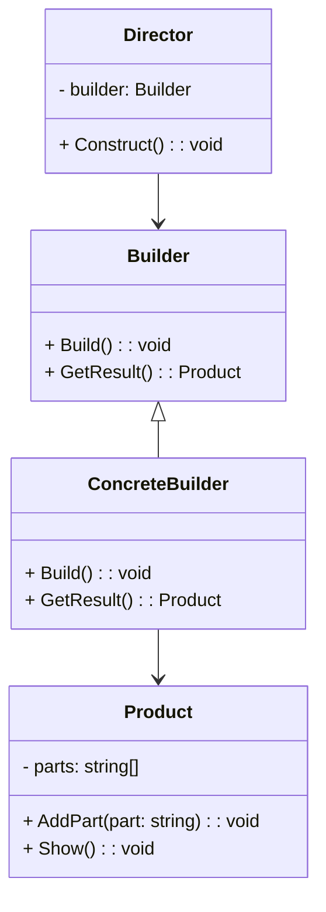

# Builder UML

The Builder Pattern is a creational design pattern used to construct complex objects step by step. 
It removes the complexity of constructing an object into a dedicated builder class for that object type.

Parts of the Builder Pattern:

1. **Builder Interface**: Define an abstract interface for creating parts of a complex object. This interface typically 
includes methods for building each part of the object separately. The builder also provides a method for assembly of the 
final object from the parts already built. There is also an optional method `getProduct` that can be used to get the
already assembled product.

2. **Concrete Builders**: Implement the builder interface to provide specific implementations for building parts of the 
object. Each concrete builder is responsible for creating a particular variant of the complex object.

3. **Director**: The director is responsible for using the builder to construct the object. It knows the steps and 
sequence involved in building the object and orchestrates the construction process. Director is rarely implemented as 
a separate class; its usually in the class that will use the product that implements the director. The director
typically uses method chaining on the many methods needed to construct the object. Method chaining requires the methods 
to return the object itself.

4. **Product**: The final object being constructed. It's usually a complex object made up of multiple parts.

The key idea behind the Builder Pattern is to provide a clear separation between the construction logic and the 
representation of an object. This makes it easier to change the internal representation of the object without 
modifying the way it's constructed. It's particularly useful when dealing with complex objects with many optional 
parameters or configurations.

NOTES:
- the client will pass the director an instantiated builder object as well as the data necessary to build the product
- it is also common to implement the builder class as an inner static class inside the product class
