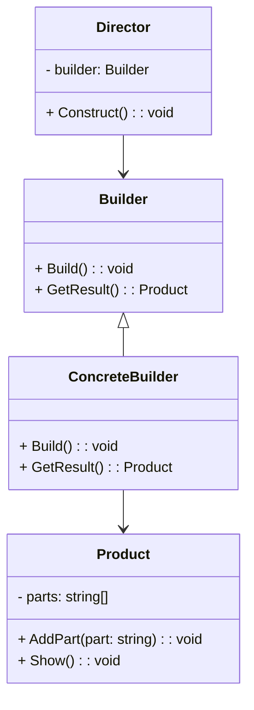

# Builder UML

```mermaid
classDiagram
    class Director {
        + Construct(): void
        - builder: Builder
    }

    class Builder {
        + Build(): void
        + GetResult(): Product
    }

    class ConcreteBuilder {
        + Build(): void
        + GetResult(): Product
    }

    class Product {
        - parts: string[]
        + AddPart(part: string): void
        + Show(): void
    }

    Director --> Builder
    Builder <|-- ConcreteBuilder
    ConcreteBuilder --> Product
```