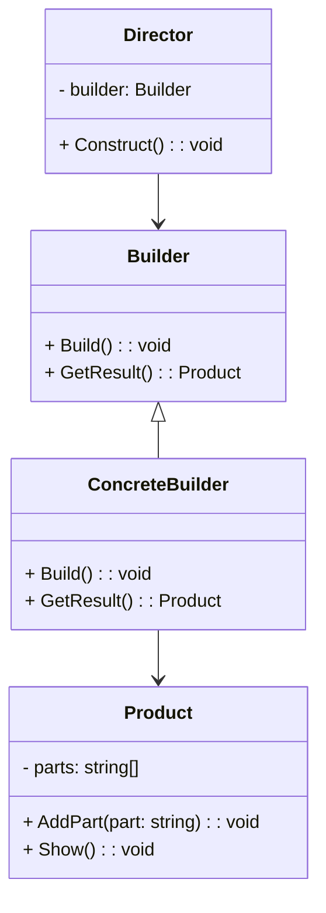

# Builder UML

The Builder Pattern is a creational design pattern used to construct complex objects step by step. It separates the construction of an object from its representation, allowing the same construction process to create different representations.

Here's how it works:

1. **Builder Interface**: Define an abstract interface for creating parts of a complex object. This interface typically includes methods for building each part of the object.

2. **Concrete Builders**: Implement the builder interface to provide specific implementations for building parts of the object. Each concrete builder is responsible for creating a particular variant of the complex object.

3. **Director**: The director is responsible for using the builder to construct the object. It knows the steps involved in building the object and orchestrates the construction process.

4. **Product**: The final object being constructed. It's usually a complex object made up of multiple parts.

The key idea behind the Builder Pattern is to provide a clear separation between the construction logic and the representation of an object. This makes it easier to change the internal representation of the object without modifying the way it's constructed. It's particularly useful when dealing with complex objects with many optional parameters or configurations.

