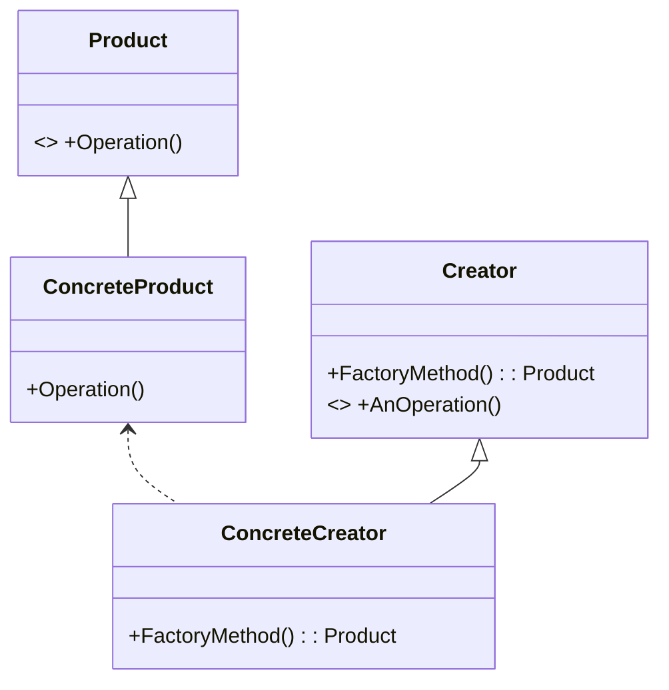

# Factory Method UML

The Factory Method design pattern is a creational pattern that provides an interface for creating objects in a 
superclass but allows subclasses to alter the type of objects that will be created. It defines an interface 
(usually an abstract class) for creating objects, but allows subclasses to decide which class to instantiate.

Here's how the pattern works:

- **Creator:** This is an abstract class or interface that declares the factory method, which returns an object of type 
Product. It may also contain other methods that use the Product returned by the factory method.
- **ConcreteCreator:** This is a subclass of Creator that implements the factory method. It creates an instance of
itself and returns it.
- **Product:** This is an abstract class or interface that defines the interface of objects the factory method creates.
- **ConcreteProduct:** These are the subclasses of Product that provide specific implementations.

The key idea behind the Factory Method pattern is to decouple the client code from the specific classes it uses, 
allowing for flexibility in object creation. Instead of directly instantiating concrete classes, the client code 
interacts with the factory method defined in the Creator class. This allows different subclasses of Creator to create 
different types of Product objects based on specific requirements.

This pattern is particularly useful in scenarios where:

- there may be future additions to a product inheritance hierarchy
- delegate the objection instantiation to subclasses is desired

By using the Factory Method pattern, you can achieve a higher level of abstraction and flexibility in your code, 
promoting easier maintenance, scalability, and code reuse.
