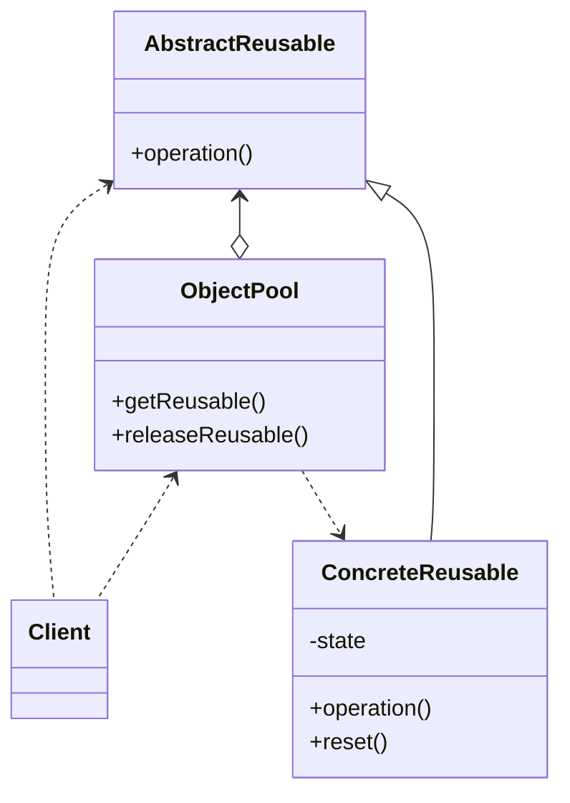

# Object Pool

When a lot of objects which are expensive to create are needed, an object pool is useful, but it can hurt your 
applications performance if object pool is not implemented correctly and carefully.

## implementation

- provide thread-safe caching of objects in memory
- provide methods that client can call to get object from the pool
- provide method that client can call to get an unused object
- class whose objects we will pool must provide a method so that the object can be reset before returning it to the client
- how to handle when all objects in pool are currently being used
  - wait for an object to become free if limited resources 
  - create a new object
