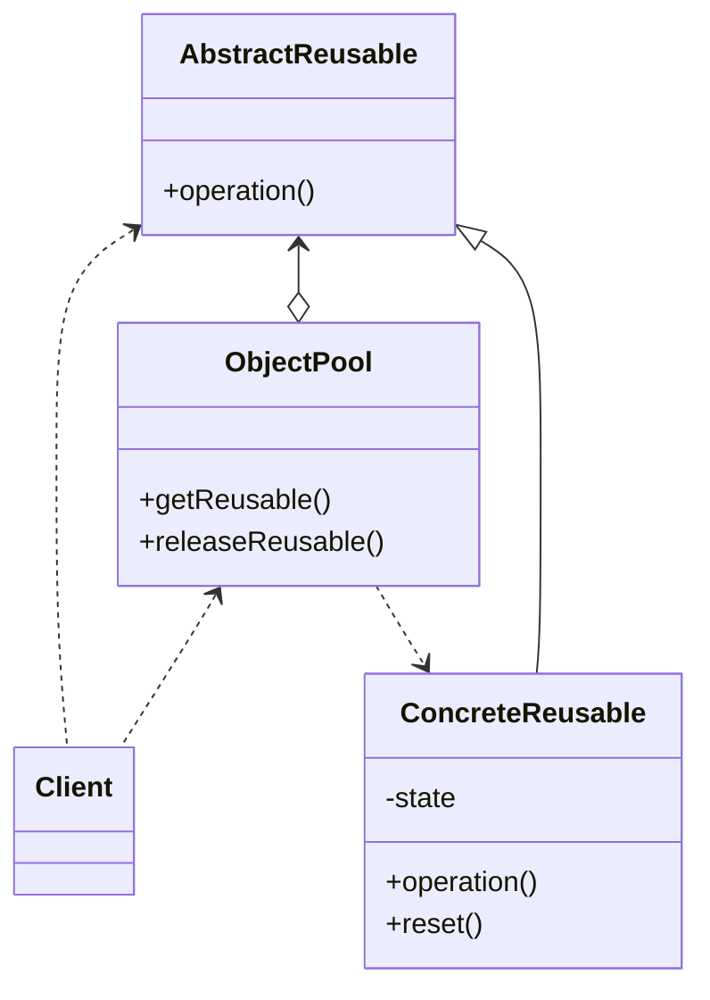

# Object Pool

When a lot of objects which are expensive to create are needed, an object pool is useful, but it can hurt your 
applications performance if object pool is not implemented correctly and carefully. Pooling objs is only useful when the 
objects involve costly initialization.

## implementation

- provide thread-safe caching of objects in memory
- provide methods that client can call to get object from the pool
- provide method that client can call to get an unused object
- class whose objects we will pool must provide a method so that the object can be reset before returning it to the client
- how to handle when all objects in pool are currently being used
  - wait for an object to become free if limited resources 
  - create a new object

## keep in mind
- resetting the object should not be a costly operation or we lose the benefits of the pattern
- can pre-cache some objects when the pool is created, ao objs are ready when requested; will increase startup time and 
system memory
- the synchronization should consider the reset time needed as to not block other operations
- dont pool long lived objects (objs that a user will use for a long time). this can negatively affect the application
- dont use object pool just to try to save on memory
