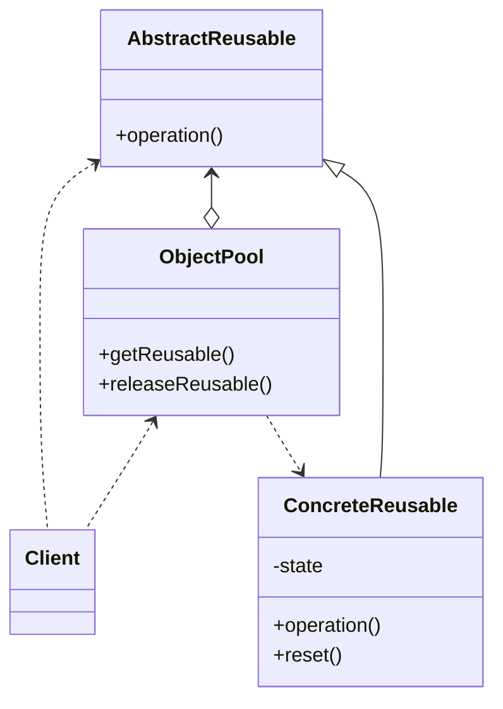

# Object Pool

When a lot of objects which are expensive to create are needed, an object pool is useful, but it can hurt your 
applications performance if object pool is not implemented correctly and carefully.

