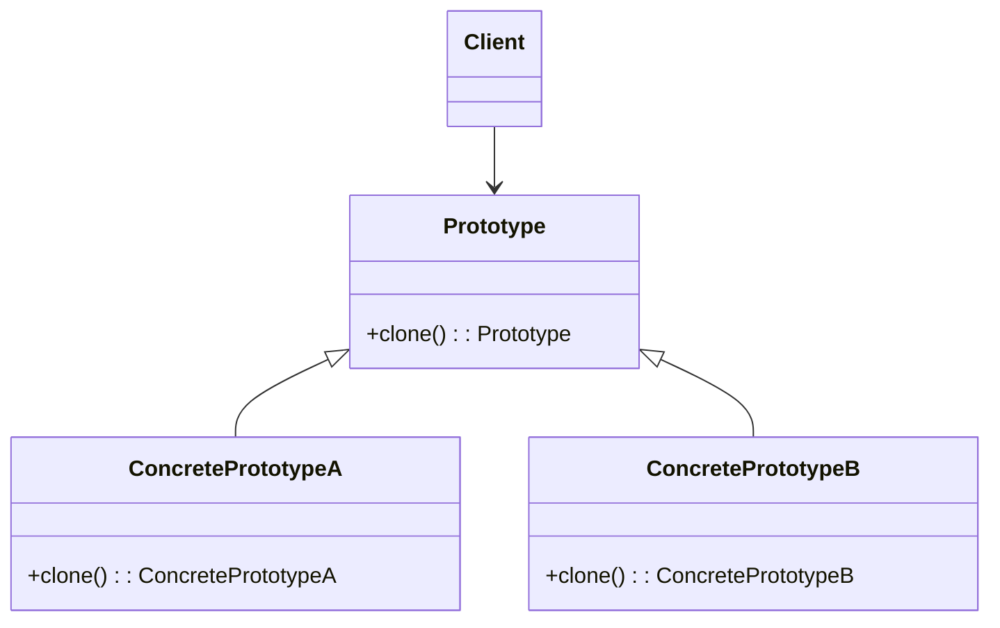

# Prototype UML

useful when:
- an object is costly to create

## Prototype Design Pattern

### Intent
The Prototype pattern is a creational design pattern that allows the creation of new objects by copying an existing 
object, known as a prototype. It aims to provide a way to create new objects with minimal effort.

### Motivation
Sometimes creating new objects is resource-intensive or complex. In such cases, creating objects by directly 
instantiating them can be inefficient or impractical. The Prototype pattern addresses this issue by providing a 
mechanism to clone existing objects. By cloning a prototype, new objects can be created with minimal overhead.

### Structure
- **Prototype**: Defines the interface for cloning itself. This is typically an abstract base class or interface.
- **ConcretePrototype**: Implements the cloning interface defined by the Prototype. These are the concrete classes 
whose instances will be cloned.
- **Client**: Uses the Prototype interface to create new objects by cloning existing prototypes.

### Participants
- **Prototype**: Declares an interface for cloning itself.
- **ConcretePrototype**: Implements the cloning interface to allow cloning of itself.
- **Client**: Creates new objects by cloning existing prototypes.

### Collaboration
- The client creates new objects by requesting the prototype to clone itself.
- The prototype creates a new object by copying its own state and returning the copy.

### Benefits
- Simplifies the creation of complex objects.
- Allows adding or removing object types at runtime.
- Avoids subclassing to create new objects.

### Drawbacks
- Cloning can be complex if the object contains nested objects or references.
- Deep cloning might be necessary for certain scenarios, increasing complexity.

### Example
Consider a graphic editor application where various shapes like circles, rectangles, etc., need to be created. 
Instead of instantiating new shapes directly, the application can maintain prototypes of each shape type. When a new 
shape is needed, the application can clone the appropriate prototype to create the new shape object.

### Applicability
Use the Prototype pattern when:
- Objects to be created are variations of existing objects, and the instantiation process is complex.
- Objects need to be created dynamically, with different configurations.

### Implementation
- Define a common interface or base class for prototypes.
- Implement the cloning mechanism in concrete prototype classes.
- Use a registry to manage and retrieve prototype instances efficiently.

### Related Patterns
- **Abstract Factory**: Similar in providing an interface for creating families of related or dependent objects but 
focuses on creating entire families of objects rather than individual instances.
- **Singleton**: Can be used with Prototype to manage a registry of prototype instances.

### Conclusion
The Prototype pattern provides a flexible and efficient way to create new objects by copying existing ones. By avoiding 
the need for complex instantiation logic, it simplifies object creation and promotes code reuse. However, careful 
consideration is needed when dealing with object state and cloning to ensure the correctness and efficiency of the 
pattern implementation.
