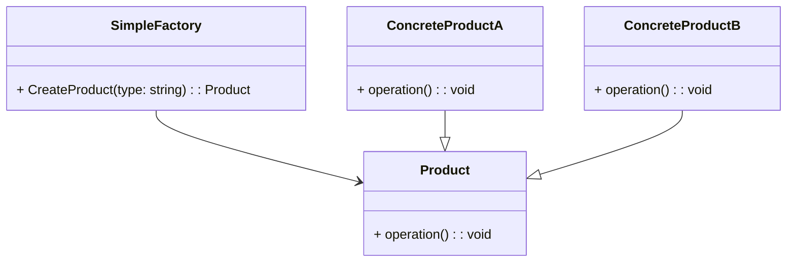

# Simple Factory UML

## What is the Simple Factory Pattern?

The Simple Factory pattern is a creational design pattern that provides a way to create objects without exposing the 
instantiation logic to the client. It encapsulates the creation of objects of a certain type behind a factory class. 
This pattern is one of the simplest forms of factory patterns and is often used when the creation of objects involves 
a complex process that the client does not need to be aware of.

## Components of the Simple Factory Pattern:

**Factory:** This is a class responsible for creating objects. It contains a method (often named something like CreateProduct) 
that takes some parameters (like a type identifier) and returns instances of different product classes based on those 
parameters.

**Product:** This is an interface or an abstract class that defines the behavior of the objects being created by the factory. 
It usually declares one or more methods that concrete products must implement.

**Concrete Products:** These are the actual objects that the factory creates. They implement the Product interface or extend the Product 
abstract class, providing specific implementations for the methods declared in the Product.

## How Does It Work?

**Client Requests Object Creation:** The client code requests an object to be created from the factory by invoking a method on the factory class, 
passing any necessary parameters.

**Factory Creates Object:** The factory class internally determines which concrete class to instantiate based on the parameters provided by the 
client.

**Object Returned to Client:** The factory instantiates the appropriate object and returns it to the client

## Benefits:

**Encapsulation:** Creation logic is encapsulated within the factory class, abstracting it away from the client code.

**Centralization:** Object creation logic is centralized in one place, making it easier to manage and modify.

**Decoupling:** Client code is decoupled from concrete product classes, promoting flexibility and easier maintenance.

## Limitations:

**Limited Extensibility:** Adding new types of products may require modifying the factory class, violating the Open/Closed Principle.

**Violation of Single Responsibility Principle:** The factory class takes on the responsibility of both creating objects and deciding which object to create.
