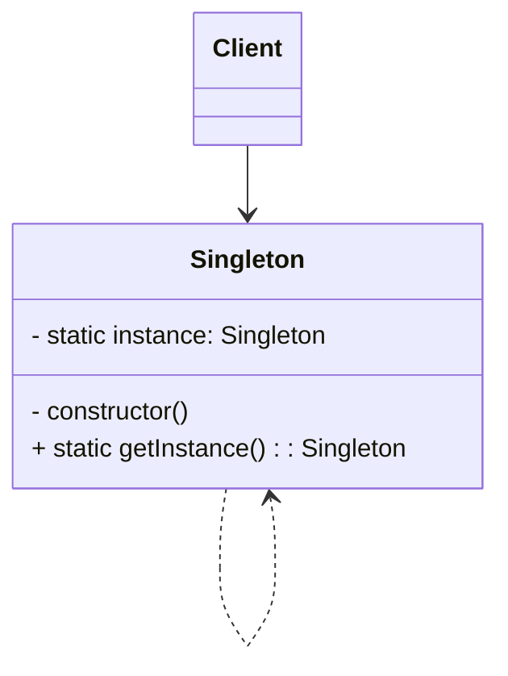

# Singleton Pattern

## about

A singleton class only has one instance, and is shared globally with a global state
subclasses and inheritance are not allowed
class constructors not available globally

## implementation

### eager singleton

instance created as soon as aclassloaded

### lazy singleton

singleton instance is created when it is first asked for

