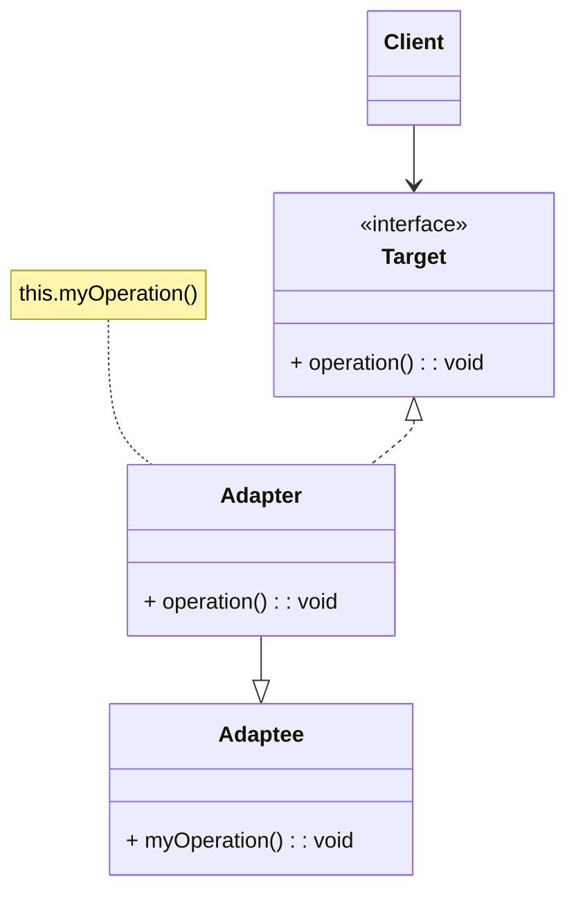

# Class Adapter Pattern UML

```mermaid
classDiagram
    class Target {
        <<interface>>
        + operation(): void
    }
    class Adaptee {
        + myOperation(): void
    }
    class Adapter {
        + operation(): void
    }
    class Client

    Target <|.. Adapter
    Adapter --|> Adaptee
    Client --> Target

    note for Adapter "this.myOperation()"
```