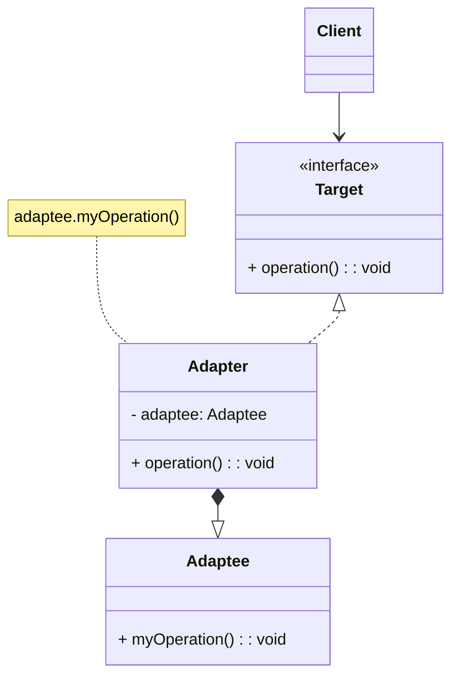

# Object Adapter Pattern UML

```mermaid
classDiagram
    class Target {
        <<interface>>
        + operation(): void
    }
    class Adaptee {
        + myOperation(): void
    }
    class Adapter {
        - adaptee: Adaptee
        + operation(): void
    }
    class Client

    Target <|.. Adapter
    Adapter *--|> Adaptee
    Client --> Target

    note for Adapter "adaptee.myOperation()"
```