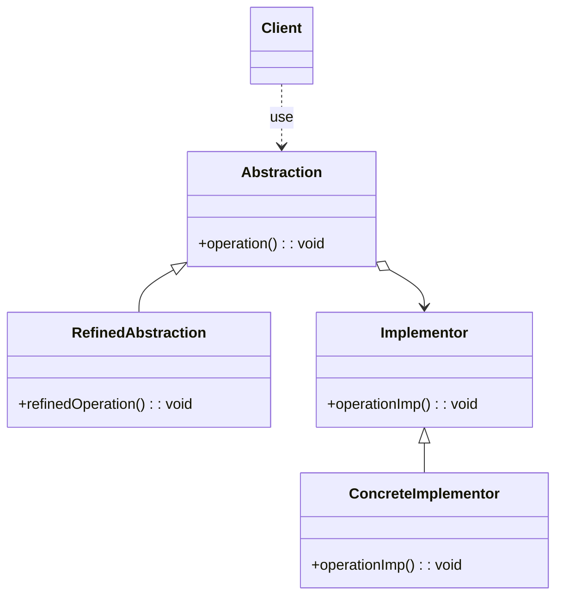

# Bridge

## About

The Bridge pattern is implemented very similar to the Adapter pattern, but Adapter is used on existing classes whereas 
Bridge is built from the ground up. Bridge is intended to allow abstraction and implementation to vary independently, but 
Adapter is meant to make unrelated classes work together.

## Pitfalls

A pitfall of Bridge is that it is complex to understand and implement. Its difficult to implement Bridge when code is 
already written because it will require a lot of rework.

## UML Diagram

