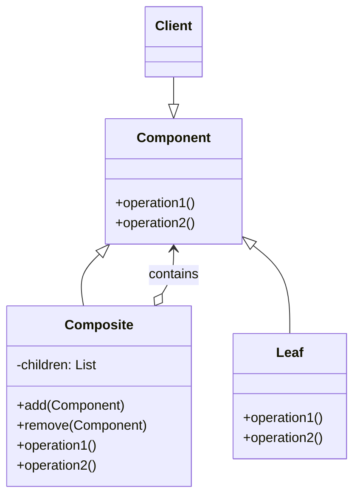

# Composite Design Pattern

## about 

Composite pattern allows an object to delegate work to its children.
It can simplify working with tree data structures.  

## UML

```mermaid
classDiagram
    class Component {
        +operation1()
        +operation2()
    }

    class Composite {
        -children: List<Component>
        +add(Component)
        +remove(Component)
        +operation1()
        +operation2()
    }

    class Leaf {
        +operation1()
        +operation2()
    }

    class Client

    Component <|-- Composite
    Component <|-- Leaf
    Composite o--> Component : contains
    Client --|> Component
```
