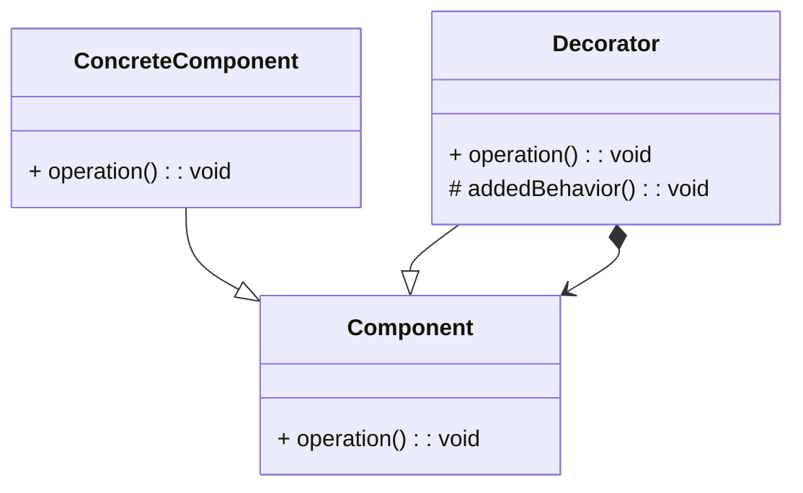

# Decorator

## About

The decorator design pattern is useful when we want to enhance behavior of existing object dynamically when required.

## How does it work

Decorator wraps an object within itself and provides the exact same interface as the wrapped object so the client of the 
original object doesn't need to change.

## UML Diagram

start with an existing component
* Define the decorator
* implements the component interface
* reference to the concrete component
* add decorator methods for additional functionality

*NOTE: Decorator can be abstract and depend on subclasses ot provide functionality*

## Design Considerations

* avoid large states in the base class
* pay attention to equals and hashCode methods of decorator
* decorators support recursive composition and so this lends itself to creating of lots of small objects and is hard 
to debug. each decorator adds a little bit of functionality
* decorators are more flexible and powerful than inheritance. inheritance is static and decorators are dynamic. 
can be stacked different ways at runtime
* decorators at as a skin (small meaningful functionality)

## Example

* java I/O package is a great example of Decorator (java.io.BufferedOutputStream decorates java.io.OutputStream)

## Decorator compared to Composite design pattern

| Decorator                                                      | Composite                         |
|----------------------------------------------------------------|-----------------------------------|
| add to existing behavior of existing obj                       | meant for obj aggregation only    |
| can be thought as degenerate composite with only one component | supports any number of components |

## Pitfalls

* often ends up with a large number of classes being added to the system because each class adds a little bit 
of functionality.
* sometimes newcomers will start using decoratos as a replacement for inheritance in every scenario

