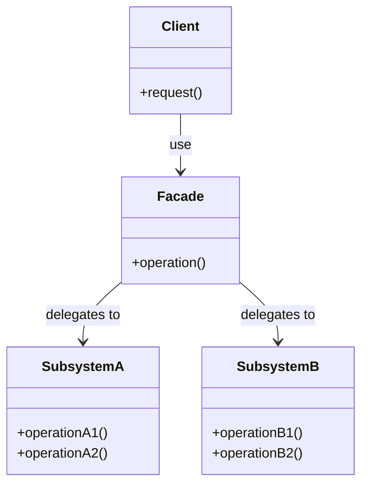

# Facade

The Facade pattern provides a simplified, unified interface to a complex subsystem, making it easier for clients to interact with the system.

## UML

```mermaid
classDiagram
    class Client {
        +request()
    }
    
    class Facade {
        +operation()
    }
    
    class SubsystemA {
        +operationA1()
        +operationA2()
    }
    
    class SubsystemB {
        +operationB1()
        +operationB2()
    }
    
    Client --> Facade : use
    Facade --> SubsystemA : delegates to
    Facade --> SubsystemB : delegates to
```
