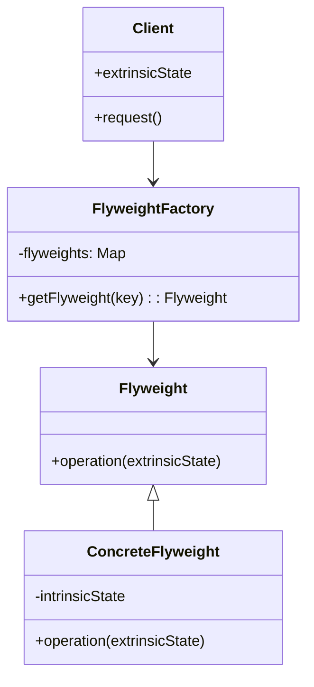

# Flyweight

The Flyweight design pattern is a structural pattern aimed at minimizing memory usage by sharing as much data as possible between similar objects. It's particularly useful when you need to create a large number of objects that share common properties.

## UML

