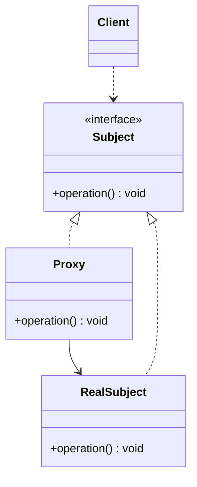

# Proxy

The Proxy design pattern is a structural pattern an object that works in place of another object.
The proxy is transparent to the client. 

## Code Examples:
* static - manually written proxy
* dynamic - proxy created at runtime

## Use Cases:
* protection - controlling access to objects
* remote - local representation of a remote object
* virtual - delays construction of original object until absolutely necessary

## UML

